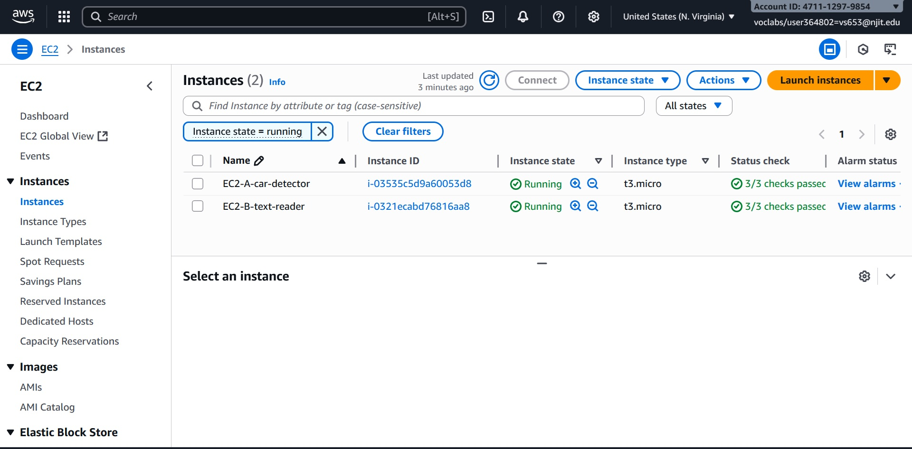
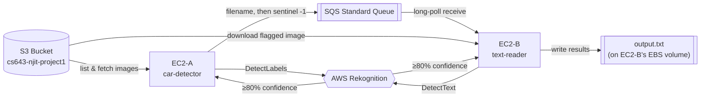

# AWS Car & Text Recognition Pipeline

A distributed, event-driven image-analysis pipeline built on EC2, S3, SQS, and Rekognition. Two independently deployable Java services coordinate through a message queue — one detects cars in images, the other reads text off the images that had a car — with neither service ever talking to the other directly.


## Overview

This started as an individual assignment for NJIT CS643 (Cloud Computing): build a working distributed system on AWS using only managed cloud primitives — no shared filesystem, no direct service-to-service calls, no single point of coordination other than a queue.

**The problem:** analyze a batch of images (detect cars, then read any visible text) using two separate compute nodes that must produce a correct result *regardless of which one boots up first or how fast either one runs*.

**The solution:** two Java applications, each deployed to its own EC2 instance, that never call each other. `car-detector` (EC2-A) pulls images from S3 and asks Rekognition if there's a car in each one. Anything that qualifies gets its filename dropped on an SQS queue. `text-reader` (EC2-B) has no idea `car-detector` exists — it just long-polls that same queue, downloads whatever filename shows up, and asks Rekognition to read text off it. The queue is the entire contract between them.

**Who this is for:** anyone evaluating cloud/distributed-systems fundamentals — service decoupling via queues, IAM-based auth instead of hardcoded credentials, retry/backoff for transient cloud API failures, and working directly with managed ML services (Rekognition) instead of hosting a model yourself.

## Key Features

- **Fully decoupled services** — `car-detector` and `text-reader` share no code path at runtime and never call each other; SQS is the only integration point, so either can be redeployed or restarted independently.
- **Order-independent startup** — correctness doesn't depend on which EC2 instance comes up first (a hard requirement of the assignment); the queue absorbs whichever side gets there first.
- **Exponential backoff with jitter** on every AWS SDK call (S3, SQS, and Rekognition), added beyond the base assignment requirements to make the pipeline resilient to the transient throttling/network errors that are common against real AWS endpoints.
- **Long-polling SQS consumer** (20s waits) instead of tight-loop polling, to cut down on empty-receive API calls.
- **Graceful, signaled shutdown** — `car-detector` emits a sentinel message (`"-1"`) when it's out of images; `text-reader` keeps draining the queue until it sees that signal, so no image is dropped by a race at the end of the run.
- **At-least-once-safe message handling** — an in-memory de-dup set on the consumer side, since SQS standard queues can redeliver.
- **No hardcoded credentials anywhere** — both services use the AWS SDK's `DefaultCredentialsProvider`, which picks up EC2 instance-role credentials or the AWS Academy Learner Lab's temporary session credentials automatically.
- **Confidence-gated inference** — both the car label detection and the text detection only act on Rekognition results at ≥80% confidence, per the assignment spec.

## Demo

📺 **[Watch the demo video](https://youtu.be/V_pxyKxnAhU)** — compiling and running both services end-to-end against live AWS infrastructure.



More setup/verification screenshots (security group, SQS queue, per-instance file structure, build output) are in [`docs/images/`](docs/images/).

## Architecture



**Data flow:**
1. `car-detector` lists the S3 bucket, pulls the first *N* images (sorted numerically), and runs Rekognition `DetectLabels` on each.
2. Any image with a `Car` label at ≥80% confidence gets its filename sent to SQS.
3. Once all *N* images are checked, `car-detector` sends a `"-1"` sentinel and exits.
4. `text-reader` long-polls the same queue the whole time. For every filename it receives, it downloads the image from S3 and runs Rekognition `DetectText`.
5. Text lines at ≥80% confidence are collected; on seeing the sentinel (and draining anything still in flight), `text-reader` writes everything to `output.txt` and exits.

For the exact message contract, retry policy, and a couple of known design trade-offs, see **[docs/architecture.md](docs/architecture.md)**.

## Tech Stack

| Category | Technology |
|---|---|
| Language | Java 17 |
| Build | Maven, Maven Shade Plugin (fat-jar packaging) |
| Cloud compute | Amazon EC2 (Amazon Linux 2023) |
| Cloud storage | Amazon S3 |
| Messaging | Amazon SQS (Standard queue) |
| ML / inference | Amazon Rekognition (`DetectLabels`, `DetectText`) |
| AWS SDK | AWS SDK for Java v2 (`s3`, `sqs`, `rekognition` modules) |
| Logging | SLF4J (`slf4j-simple`) |
| Auth | IAM instance-role / AWS Academy Learner Lab temporary credentials via `DefaultCredentialsProvider` |

## Getting Started

### Prerequisites
- An AWS account or AWS Academy Learner Lab session
- Two EC2 instances (Amazon Linux 2023, `t3.micro` is sufficient) reachable via SSH
- Java 17, Maven, and the AWS CLI on both instances
- An S3 bucket of `.jpg` images (the assignment used a shared public bucket: `cs643-njit-project1`)

### 1. Provision networking
Create a security group allowing inbound **SSH, HTTP, HTTPS from your IP only** (default VPC). Screenshot: [`docs/images/securitygroup_aws_mgmt_console.jpg`](docs/images/securitygroup_aws_mgmt_console.jpg)

### 2. Launch two EC2 instances
Amazon Linux 2023, `t3.micro`, using the security group above. Name one for car detection, one for text reading, and note both public IPs.

### 3. Create the SQS queue
Standard queue, default settings. Note the queue URL.

### 4. Connect and prepare each instance
```bash
ssh -i <key_filename>.pem ec2-user@<EC2-PUBLIC-IP>
sudo yum update -y
sudo dnf install -y java-17-amazon-corretto maven awscli
java -version && mvn -v && aws --version
```

### 5. Configure AWS credentials (both instances)
```bash
mkdir -p ~/.aws
nano ~/.aws/credentials   # paste the Access Key / Secret Key / Session Token from your AWS Details page
export AWS_REGION=us-east-1
export AWS_DEFAULT_REGION=us-east-1
aws sts get-caller-identity   # should print your account/role, confirming the credentials work
```

### 6. Set convenience env vars (both instances)
```bash
export BUCKET="cs643-njit-project1"
export QUEUE_URL="<your SQS queue URL>"
```

### 7. Deploy and build
On EC2-A:
```bash
mkdir ~/car-detector && cd ~/car-detector
# upload/clone this repo's car-detector/ folder here
mvn clean package
ls target/    # expect car-detector-1.0.0.jar
```
On EC2-B:
```bash
mkdir ~/text-reader && cd ~/text-reader
# upload/clone this repo's text-reader/ folder here
mvn clean package
ls target/    # expect text-reader-1.0.0.jar
```

### 8. Run
Order doesn't matter — start either one first.

On EC2-A:
```bash
java -jar target/car-detector-1.0.0.jar --bucket "$BUCKET" --queue-url "$QUEUE_URL" --max-images 10
```
On EC2-B:
```bash
java -jar target/text-reader-1.0.0.jar --bucket "$BUCKET" --queue-url "$QUEUE_URL" --out /home/ec2-user/output.txt
```

| Flag | Required | Default | Meaning |
|---|---|---|---|
| `--bucket` | yes | — | S3 bucket to read images from |
| `--queue-url` | yes | — | SQS queue URL used for coordination |
| `--max-images` | no | `10` | how many images `car-detector` scans |
| `--out` | no | `/home/ec2-user/output.txt` | where `text-reader` writes results |

### 9. Verify
```bash
cat /home/ec2-user/output.txt
```
See [`docs/examples/sample-output.txt`](docs/examples/sample-output.txt) for a real captured run.

### 10. Tear down
Stop both EC2 instances and end the Learner Lab session when you're done, to avoid ongoing charges.

## Project Structure

```
aws-car-text-recognition-pipeline/
├── car-detector/         # EC2-A: Rekognition DetectLabels → SQS
│   ├── pom.xml
│   └── src/main/java/com/cs643/...
├── text-reader/          # EC2-B: SQS → S3 download → Rekognition DetectText → output.txt
│   ├── pom.xml
│   └── src/main/java/com/cs643/...
└── docs/
    ├── architecture.md   # message contract, retry policy, design notes
    ├── images/           # AWS console + build/run screenshots
    └── examples/         # a real captured output.txt
```

Both modules share the same internal package layout (`config`, `awssdk`, `s3`, `sqs`, `rek`, `util`, `model`) even though they're independent Maven projects — same conventions, different responsibilities.

## Testing

No automated test suite is included — this was validated by running both services against a live AWS environment (real S3 bucket, real SQS queue, real Rekognition calls) and confirming the output against the AWS Console. See [`docs/images/`](docs/images/) for console verification screenshots and [`docs/examples/sample-output.txt`](docs/examples/sample-output.txt) for a captured run. Adding a proper test suite (e.g., JUnit + LocalStack for mocked AWS calls) is on the [roadmap](#roadmap--future-improvements) below.

## Results

A real run against the assignment's 10-image bucket correctly identified 4 images with both a car and readable text:

```
1.jpg: "$ BR8167"
4.jpg: "YHI9 OTZ"
3.jpg: "45 P P 11:50 85% PARKING"
7.jpg: "Lamborghini LP 610 LB"
```

License plates, a parking sign, and a car-model badge were all read correctly at ≥80% Rekognition confidence — including on images where the "car" detection triggered on a badge/logo rather than the whole vehicle. This assignment received **an A**.

### Challenges

- Getting the coordination right without either instance depending on the other's startup order took real thought — the sentinel message plus a "drain-then-exit" consumer loop turned out to be the cleanest solution.
- This was my first time working with AWS Rekognition, and I ran into a few non-obvious errors (confidence field nullability, `TextTypes.LINE` vs `WORD` detections) while wiring it up.
- **AI assistance:** I used an AI assistant to break the assignment's requirements down into a task checklist, and to help explain a couple of the Rekognition-related errors above once I hit them. I did not use it to author the core application logic — the architecture and code are mine. I found it most useful for project-management (staying organized against the spec) and as a faster way to interpret unfamiliar SDK error messages than reading Javadoc alone.

## Roadmap / Future Improvements

- [ ] Automated tests (JUnit + LocalStack for mocked S3/SQS/Rekognition)
- [ ] CI pipeline (GitHub Actions) to build both modules and run tests on push
- [ ] Infrastructure as code (Terraform or CloudFormation) instead of manual console setup
- [ ] Containerize both services (Docker) as an alternative to raw EC2 deployment
- [ ] Make the 80% confidence threshold configurable via CLI flag instead of hardcoded
- [ ] Emit structured JSON results instead of plain text (the `jackson-databind` dependency is already declared in both `pom.xml` files but currently unused — this would put it to work)

## My Role & Contributions

This was an **individual assignment** — I designed and wrote both services end-to-end: the AWS architecture, the Java application code in both modules, the retry/backoff resilience layer (added beyond the base requirements), and provisioned/configured all the AWS infrastructure (EC2, security groups, SQS) through the AWS Console.

## License

[MIT](LICENSE) — feel free to reuse or adapt for learning purposes.
