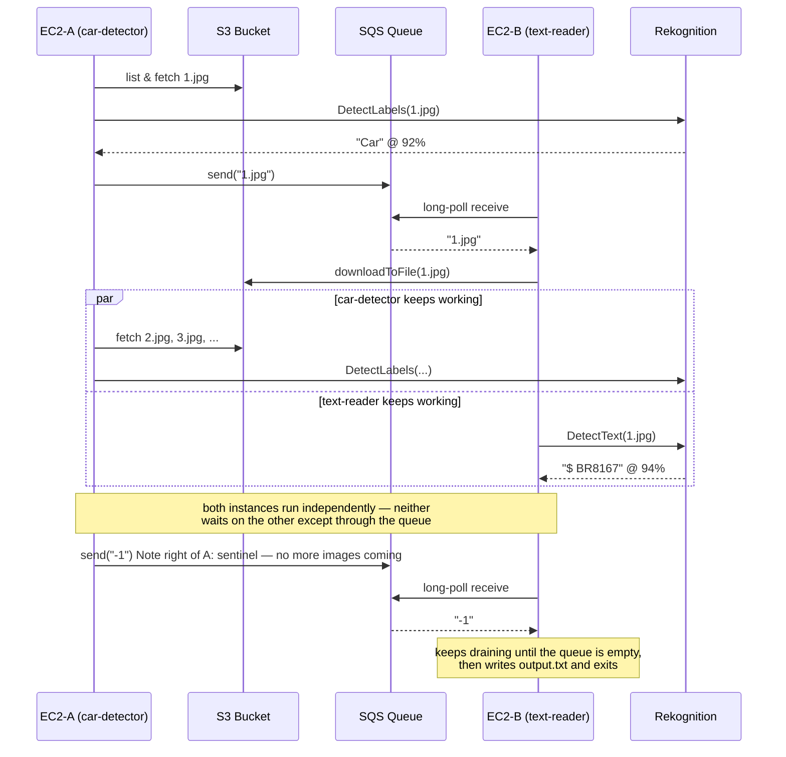

# Architecture Deep Dive

This document covers the parts of the design that don't fit in the top-level README: the exact message contract between the two services, the retry policy, and a few known trade-offs.

## Sequence of a run

The key property being demonstrated: `car-detector` and `text-reader` never reference each other, and correctness doesn't depend on which one starts first. `text-reader` just long-polls forever (20s waits) until it either gets a real filename or the sentinel; `car-detector` just produces messages until it runs out of images. SQS is the entire integration surface.

## Message contract

| Message body | Meaning | Producer | Consumer action |
|---|---|---|---|
| `"<n>.jpg"` (e.g. `"3.jpg"`) | Image `<n>.jpg` had a `Car` label at ≥80% confidence | `car-detector` | Download from S3, run `DetectText`, delete message |
| `"-1"` (`Messages.SENTINEL`) | No more images will be sent | `car-detector` (sent exactly once, after all images are checked) | Stop waiting for new work once the queue is otherwise empty; delete message |

- Images are selected as the first *N* `.jpg` keys in the bucket, **sorted numerically by the number in the filename** (`KeySort`), not by S3's default lexicographic listing order — so `2.jpg` sorts before `10.jpg`.
- `text-reader` de-duplicates by message body in an in-memory `Set` before processing, since SQS standard queues guarantee *at-least-once* delivery and can redeliver a message that was already handled.
- Every SQS message is deleted only **after** it's been fully processed (or recognized as the sentinel) — if a `text-reader` process died mid-processing, that message would become visible again after the visibility timeout rather than being silently lost.

## Retry policy

Every outbound AWS SDK call (S3, SQS, Rekognition) is wrapped in `Retry.withBackoff(name, maxAttempts, operation)`:

- Starts at a 200ms base delay, **doubles on each failure, capped at 5s**
- Adds ±20% random jitter to each delay, to avoid synchronized retry storms if both instances hit throttling at the same time
- S3 and SQS operations get **4 attempts**; Rekognition operations get **3 attempts** (Rekognition calls are more expensive, so fewer retries before surfacing the failure)
- On final failure, the wrapped exception's message is preserved so the root cause (not just "retry exhausted") shows up in the logs

This was added on top of the base assignment requirements — an early version failed occasionally under transient throttling from the shared class S3 bucket, and made the case for treating cloud API calls as unreliable by default.

## Known design trade-offs

A few things worth knowing if you're reading the code closely:

- **Downloaded images aren't cleaned up.** `text-reader` writes each image to `/tmp/<sanitized-key>` and never deletes it. Fine for a 10-image assignment run; would need a cleanup step (or `Files.deleteIfExists` after processing) for a long-running deployment.
- **Car matching is an exact label match.** `hasCarAbove80` only checks for a Rekognition label literally named `"Car"` at ≥80% — it won't match related labels Rekognition sometimes returns instead (e.g. `Vehicle`, `Transportation`, a specific make/model). That was sufficient for the assignment's image set but is a place to broaden if reused elsewhere.
- **The 80% confidence threshold is hardcoded** identically in both services rather than being a shared constant or CLI flag — see the [roadmap](../README.md#roadmap--future-improvements).
- **`jackson-databind` is declared in both `pom.xml` files but isn't used anywhere in the code.** Likely left over from an early draft; either remove it or use it to emit structured JSON output (see roadmap).
